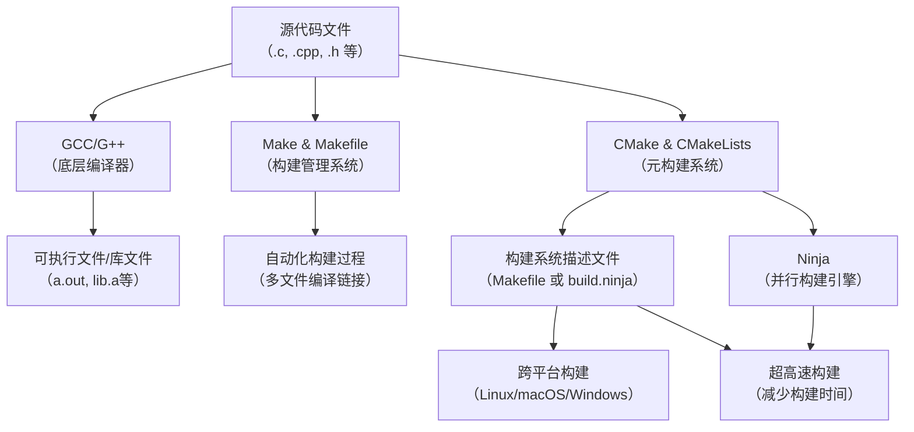
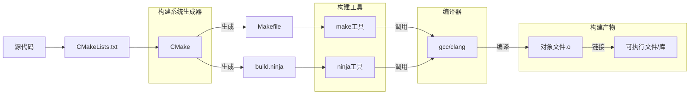

# C编译工具

- GCC：将源代码编译为可执行文件
- Make & Makefile：自动化构建工具，通过规则定义编译流程
- CMake & CMakeLists：跨平台构建系统生成器，生成Makefile或Ninja文件
- Ninja：高性能构建工具（替代make）



## gcc

- 编译到可执行文件

```bash
gcc hello.c -o hello
```

- 编译多个源文件

直接编译到可执行

```bash
gcc main.c utils.c -o program
```

分步编译（编译+链接）

```bash
gcc -c main.c -o main.o
gcc -c utils.c -o utils.o
gcc main.o utils.o -o program
```

- 指定输出类型

生成动态链接库（.so）

```bash
gcc -shared -fPIC main.c utils.c -o libprogram.so
```

生成静态链接库（.a）

```bash
gcc -c main.c utils.c
ar rcs libprogram.a main.o utils.o
```

- 使用链接库

链接生成可执行文件

```bash
# -L指定库文件所在目录，-l指定库名（不带lib前缀和.so后缀）
gcc -L /path/to/lib -lmylib main.o -o program
```

在执行程序之前，需要设置环境变量动态链接库环境变量（静态链接库无需设置，因为已经嵌入可执行文件中）

```bash
export LD_LIBRARY_PATH=/path/to/lib:$LD_LIBRARY_PATH:.
```

如果动态链接库安装在标准库路径下（如/usr/lib），只需
`ldconfig`
命令更新缓存即可

- 常用参数

`-Iinclude_dir`：指定头文件目录

`-Llib_dir`：指定库文件目录

`-llibname`：链接动态库（如`-lpthread`）

`-O1`、`-O2`、`-O3`：不同的优化级别，数字越大优化越激进，默认`-O0`

`-Os`：优化以减小可执行文件大小

`-g`：生成调试信息

`-Wall`：启用所有警告

`-std=c99`、`-std=c11`：指定C语言标准

## make & Makefile

- 基础语法

```makefile
target: dependencies
	command # 注意：command前必须用TAB缩进
```

- 基础示例

目录结构
```
project/
├── main.c
├── utils.c
├── utils.h
└── Makefile
```

Makefile

```makefile
# 定义编译器和选项
CC = gcc
CFLAGS = -Wall -g

TARGET = program
OBJS = main.o utils.o

# 默认目标
all: $(TARGET)

# 可执行文件依赖对象文件
$(TARGET): $(OBJS)
	$(CC) $(CFLAGS) -o $@ $^

# 模式规则：从.c生成.o
main.o: main.c utils.h
	$(CC) $(CFLAGS) -c main.c

utils.o: utils.c utils.h
	$(CC) $(CFLAGS) -c utils.c

# 清理构建产物
clean:
	rm -f $(OBJS) $(TARGET)
```

使用命令

```bash
make       # 构建项目
make clean # 清理生成的文件
```

- 高级特性

自动变量

`$@`：当前目标名

`$<`：第一个依赖文件

`$^`：所有依赖文件

`$?`：比目标新的依赖文件

```makefile
%.o: %.c                        # 对于每一个 .o 文件，它都由同名的 .c 文件生成
	$(CC) $(CFLAGS) -c $< -o $@ # 这里 $< 即对应的 .c 文件，$@ 即对应的 .o 文件
```

函数应用

```makefile
# 获取所有.c文件
SRCS = $(wildcard *.c)
# 将.c替换为.o
OBJS = $(patsubst %.c,%.o,$(SRCS))
```

条件判断

```makefile
DEBUG ?= 1 # 没有定义时默认1
ifeq ($(DEBUG),1)
	CFLAGS += -DDEBUG -O0
else
	CFLAGS += -O3
endif
```

- 使用技巧

增量编译：`make`仅重建修改过的文件

并行构建：`make -j8`（使用8个线程）

查看依赖图：`make -Bnd | make2graph | dot -Tpng > deps.png`

## cmake & CMakeLists

- 基础示例

目录结构

```
project/
├── CMakeLists.txt
├── include/
│   └── utils.h
├── src/
│   ├── main.c
│   └── utils.c
└── build/  # 构建目录
```

CMakeLists.txt

```cmake
cmake_minimum_required(VERSION 3.12)
project(MyProject VERSION 1.0.0 LANGUAGES C)

# 设置C标准
set(CMAKE_C_STANDARD 11)
set(CMAKE_C_STANDARD_REQUIRED ON)

# 设置编译选项
set(CMAKE_C_FLAGS "${CMAKE_C_FLAGS} -Wall -Wextra -Wpedantic")

# 收集源文件到构建系统
set(SOURCES 
    src/main.c
    src/utils.c
)

# 创建可执行文件
add_executable(${PROJECT_NAME} ${SOURCES})

# 包含头文件目录
target_include_directories(${PROJECT_NAME} PRIVATE include)
```

- 常用命令

`add_executable()`：创建可执行目标

`add_library()`：创建库目标

`target_link_libraries()`：链接库到目标

`target_include_directories()`：添加头文件搜索路径

`find_package()`：查找系统依赖包

`add_subdirectory()`：添加子目录构建

`set()` / `unset()`：设置/取消变量

`message()`：打印构建信息

`option()`：创建配置选项

- 复杂项目示例

目录结构

```
complex-project/
├── CMakeLists.txt             # 全局配置，包含子目录
├── app/
│   ├── CMakeLists.txt         # 构建主程序
│   └── main.cpp
├── include/                   # 所有公共头文件
│   ├── app/
│   │   ├── common.h
│   │   └── legacy.h           # 添加extern "C"保护
│   ├── core/
│   │   └── core.h
│   └── utils/
│       └── utils.h
├── lib/
│   ├── CMakeLists.txt         # 添加core和utils子目录
│   ├── core/
│   │   ├── CMakeLists.txt     # 构建核心库
│   │   └── core.cpp           # #include <core/core.h>
│   └── utils/
│       ├── CMakeLists.txt     # 构建工具库
│       └── utils.cpp          # #include <utils/utils.h>
├── tools/
│   ├── CMakeLists.txt         # 添加tool-a和tool-b
│   ├── tool-a/
│   │   ├── CMakeLists.txt     # 构建独立工具
│   │   └── tool_a.cpp
│   └── tool-b/
│       ├── CMakeLists.txt
│       └── tool_b.cpp
└── test/
    └── CMakeLists.txt         # 构建测试程序
```

complex-project/CMakeLists.txt

```cmake
cmake_minimum_required(VERSION 3.15)
project(ComplexProject VERSION 1.0.0 LANGUAGES CXX)

# 全局配置
set(CMAKE_CXX_STANDARD 17)
set(CMAKE_CXX_STANDARD_REQUIRED ON)
set(CMAKE_CXX_EXTENSIONS OFF)

# 设置构建类型（默认为Debug）
if(NOT CMAKE_BUILD_TYPE)
    set(CMAKE_BUILD_TYPE "Debug")
endif()

# 创建构建配置选项
option(BUILD_TESTS "Build test cases" ON)
option(BUILD_TOOLS "Build tool applications" ON)
option(BUILD_SHARED_LIBS "Build shared libraries" OFF)
option(INSTALL_PROJECT "Generate installation targets" ON)

# 设置公共头文件路径（全局可用）
include_directories(${CMAKE_SOURCE_DIR}/include)

# 添加子项目
add_subdirectory(lib)

if(BUILD_TOOLS)
    add_subdirectory(tools)
endif()

add_subdirectory(app)

if(BUILD_TESTS)
    # 查找测试框架
    find_package(GTest REQUIRED)
    include(GoogleTest)
    add_subdirectory(test)
endif()

# 安装配置
if(INSTALL_PROJECT)
    # 安装主程序
    install(TARGETS ${PROJECT_NAME}
            RUNTIME DESTINATION bin)     # 可执行文件 -> /usr/bin
    
    # 安装库文件
    install(TARGETS CoreLib UtilsLib
            EXPORT ComplexProjectTargets # 允许其他项目通过find_package()命令发现并使用该库
            LIBRARY DESTINATION lib      # 静态库(.a) -> /usr/lib
            ARCHIVE DESTINATION lib)     # 动态库(.so) -> /usr/lib
    
    # 安装头文件
    install(DIRECTORY include/ DESTINATION include) # 头文件 -> /usr/include
endif()
```

lib/CMakeLists.txt

```cmake
# 添加核心库和工具库
add_subdirectory(core)
add_subdirectory(utils)

# 创建组合库目标（方便上层链接）
add_library(ProjectLib INTERFACE)
target_link_libraries(ProjectLib INTERFACE CoreLib UtilsLib)
```

lib/core/CMakeLists.txt

```cmake
# 收集源文件
file(GLOB CORE_SOURCES "*.cpp")

# 处理共享库/静态库选项
add_library(CoreLib ${CORE_SOURCES})

# 设置公共头文件路径
target_include_directories(CoreLib PUBLIC
    $<BUILD_INTERFACE:${CMAKE_SOURCE_DIR}/include/core>
    $<INSTALL_INTERFACE:include/core>
)

# 添加版本信息
set_target_properties(CoreLib PROPERTIES
    VERSION ${PROJECT_VERSION}
    SOVERSION 1
    POSITION_INDEPENDENT_CODE ON  # 兼容共享库构建
)

# 设置输出目录
set_target_properties(CoreLib PROPERTIES
    ARCHIVE_OUTPUT_DIRECTORY ${CMAKE_BINARY_DIR}/lib
    LIBRARY_OUTPUT_DIRECTORY ${CMAKE_BINARY_DIR}/lib
    RUNTIME_OUTPUT_DIRECTORY ${CMAKE_BINARY_DIR}/bin
)
```

app/CMakeLists.txt

```cmake
# 创建可执行文件
add_executable(${PROJECT_NAME} main.cpp)

# 链接项目库
target_link_libraries(${PROJECT_NAME} PRIVATE ProjectLib)

# 添加应用程序特定头文件
target_include_directories(${PROJECT_NAME} PRIVATE
    ${CMAKE_SOURCE_DIR}/include/app
)

# 设置输出目录
set_target_properties(${PROJECT_NAME} PROPERTIES
    RUNTIME_OUTPUT_DIRECTORY ${CMAKE_BINARY_DIR}/bin
)
```

tools/CMakeLists.txt

```cmake
# 添加所有工具子目录
add_subdirectory(tool-a)
add_subdirectory(tool-b)
```

tools/tool-a/CMakeLists.txt

```cmake
# 创建可执行文件
add_executable(ToolA tool_a.cpp)

# 添加头文件（已全局设置，可省略）
# target_include_directories(ToolA PRIVATE
#     ${CMAKE_SOURCE_DIR}/include/utils
# )

# 链接Utils库（直接使用具体库目标）
target_link_libraries(ToolA PRIVATE UtilsLib)

# 设置输出目录
set_target_properties(ToolA PROPERTIES
    RUNTIME_OUTPUT_DIRECTORY ${CMAKE_BINARY_DIR}/tools
)
```

## ninja

- 基本使用

构建文件通常由CMake生成（也可手动编写`build.ninja`）

```bash
# 生成构建目录
cmake -S . -B build -G Ninja

# 执行构建（默认使用所有核心）
cd build
ninja

# 构建特定目标
ninja my_target

# 清理构建产物
ninja clean
```

- 使用技巧

增量构建：`ninja`仅重建修改过的文件

并行构建：`ninja -j8`（使用8个线程）

查看依赖图：`ninja -t graph | dot -Tpng > graph.png`

## 总结

- 工具链协作



- 完整构建流程

指定make

```bash
# 1. 使用CMake生成Makefile
cmake -S . -B build -G "Unix Makefiles"

# 2. 使用make构建项目
cmake --build build

# 或者直接使用make
cd build
make -j8

# 3. 运行程序
./build/myprogram

# 4. 清理构建产物
cmake --build build --target clean
# 或
cd build && make clean
```

指定ninja

```bash
# 1. 使用CMake生成Ninja构建文件
cmake -S . -B build -G Ninja

# 2. 使用ninja进行构建
cmake --build build --parallel

# ...
```

***
🔙 [Go Back](README.md)
