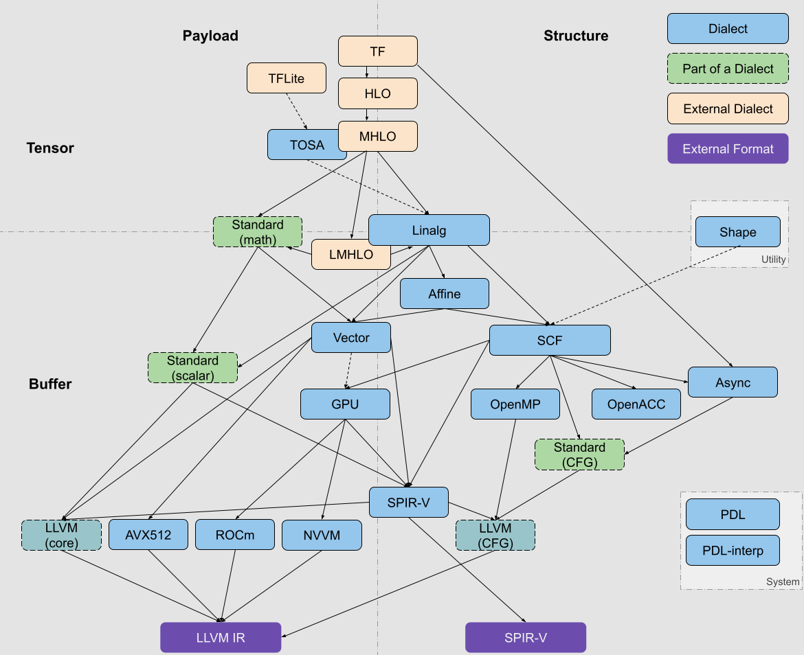

# MLIR Dialect 体系

## Dialect 关键元素

- **Operation**：具体的指令/操作，如加法（`arith.addi`）、卷积（`linalg.conv`）等
- **Type**：特定类型，如整数、浮点数组、张量等，也可以自定义类型
- **Attribute**：操作的元数据，如常量值、布局信息等
- **Region (& Block)**：支持嵌套结构（如控制流、函数体）

## Dialect Hierarchy

### 核心/基础 Dialect

| Dialect | 特点/作用 | Type | Operation举例 |
| ------- | --------- | ---- | ------------- |
| `builtin` | 提供IR的基础结构，所有Dialect的依赖基础 | 定义：基础标量类型（`i32`，`f64`，`index`等），`FunctionType`，`TupleType` 提供：`LocationAttr`及各种基础Attribute类型 | `module`（顶级容器），`unrealized_conversion_cast`（类型转换占位符），`addressof`（全局地址引用），`dense_elements_attr`（密集数组属性构造器） |
| `func` | 通用函数定义、声明、调用语义 | 复用`builtin`定义的类型（如`FunctionType`） | `func.func`，`func.call`，`func.return` |
| `arith` | 通用算术与逻辑操作 | 复用`builtin`定义的类型（如`IntegerType`，`FloatType`，`IndexType`） | `arith.addi`，`arith.cmpi`，`arith.select` |
| `index` | 索引类型及相关操作 | 操作于`builtin`定义的`IndexType` | `index.add`，`index.cast`，`index.ceildiv` |

### 控制流与数据流 Dialect

| Dialect | 特点/作用 | Type | Operation举例 |
| ------- | --------- | ---- | ------------- |
| `cf` | 基础低级控制流（分支、跳转） | 支持：基础类型（`i1`用于条件） | `cf.br`，`cf.cond_br`，`cf.switch` |
| `scf` | 结构化高级控制流（for/if/while） | 支持：`IndexType`，基础类型 | `scf.for`，`scf.if`，`scf.parallel` |
| `async` | 异步执行模型与同步原语 | 支持：基础类型 新增：`async.token`，`async.value` | `async.execute`，`async.await`，`async.yield` |
| `affine` | 静态循环与内存映射建模 | 支持：`IndexType`，`MemRefType` 核心概念：`AffineMap`（属性） | `affine.for`，`affine.load`，`affine.apply` |

### 数据结构/容器 Dialect

| Dialect | 特点/作用 | Type | Operation举例 |
| ------- | --------- | ---- | ------------- |
| `memref` | 多维缓冲区、内存块描述 | 支持：基础类型 新增：`MemRefType` | `memref.alloc`，`memref.load`，`memref.subview` |
| `tensor` | 抽象不可变张量类型 | 支持：基础类型 新增：`TensorType` | `tensor.empty`，`tensor.extract`，`tensor.collapse` |
| `vector` | 向量类型与SIMD计算 | 支持：基础类型 新增：`VectorType` | `vector.broadcast`，`vector.fma`，`vector.reduce` |
| `sparse_tensor` | 稀疏张量处理 | 支持：`TensorType` 新增：`SparseTensorType` | `sparse_tensor.convert`，`sparse_tensor.values` |
| `complex` | 复数运算 | 支持：`FloatType` 新增：`ComplexType` | `complex.re`，`complex.abs`，`complex.tanh` |
| `shape` | 动态shape建模 | 支持：`IndexType` 新增：`ShapeType` | `shape.any`，`shape.broadcast`，`shape.reduce` |
| `bufferization` | 张量-缓冲区转换 | 支持：`TensorType`，`MemRefType` | `bufferization.to_memref`，`bufferization.clone` |
| `ptr` | 指针类型和相关操作 | 支持：基础类型 新增：`PointerType` | `ptr.load`，`ptr.store`，`ptr.alloc` |

### 数值计算 Dialect

| Dialect | 特点/作用 | Type | Operation举例 |
| ------- | --------- | ---- | ------------- |
| `math` | 基础数学函数 | 支持：`FloatType`，`IntegerType` | `math.sqrt`，`math.atan2`，`math.fpowi` |
| `quant` | 量化计算支持 | 支持：`IntegerType`，`FloatType` 新增：`QuantizedType` | `quant.stats`，`quant.cast` |

### 中高层抽象/算子 Dialect

| Dialect | 特点/作用 | Type | Operation举例 |
| ------- | --------- | ---- | ------------- |
| `linalg` | 线性代数抽象 | 支持：`TensorType`，`MemRefType` | `linalg.generic`，`linalg.einsum`，`linalg.transpose` |
| `tosa` | 神经网络标准算子 | 支持：`TensorType` | `tosa.rescale`，`tosa.argmax`，`tosa.fully_connected` |

### 高层AI/ML相关 Dialect

| Dialect | 特点/作用 | Type | Operation举例 |
| ------- | --------- | ---- | ------------- |
| `ml_program` | ML程序结构 | 支持：`FunctionType`，`TensorType` | `ml_program.global_load`，`ml_program.global_store`，`ml_program.profile` |
| `tf/tflite` | TensorFlow支持 | 支持：`TensorType` | `tf.Const`，`tf.MatMul`，`tfl.custom` |
| `mhlo/chlo/stablehlo` | XLA高阶算子 | 支持：`TensorType` | `*.dot_general`，`*.convolution`，`*.reduce` |
| `torch` | PyTorch前端支持 | 支持：`TensorType`，基础类型 | `torch.aten.max_pool2d`，`torch.operator` |

tensorflow: [https://github.com/tensorflow/tensorflow/tree/master/tensorflow/compiler/mlir/tensorflow](https://github.com/tensorflow/tensorflow/tree/master/tensorflow/compiler/mlir/tensorflow) \
tflite: [https://github.com/tensorflow/tensorflow/tree/master/tensorflow/compiler/mlir/lite](https://github.com/tensorflow/tensorflow/tree/master/tensorflow/compiler/mlir/lite) \
stablehlo: [https://github.com/openxla/stablehlo](https://github.com/openxla/stablehlo) \
torch: [https://github.com/llvm/torch-mlir](https://github.com/llvm/torch-mlir)

### 硬件相关和低层 Dialect

| Dialect | 特点/作用 | Type | Operation举例 |
| ------- | --------- | ---- | ------------- |
| `llvm` | LLVM IR对接 | 支持：基础类型 新增：`LLVMStructType`，`LLVMPointerType` | `llvm.mlir.constant`，`llvm.load`，`llvm.call`，`llvm.getelementptr` |
| `spirv` | SPIR-V代码生成 | 支持：基础类型 定义：SPIR-V特定类型（`spirv.array`，`spirv.image`，`spirv.struct`等） | `spirv.SpecConstant`，`spirv.Variable`，`spirv.Load`，`spirv.CL.fmax` |
| `gpu` | GPU通用抽象 | 支持：`MemRefType` | `gpu.launch`，`gpu.memcpy`，`gpu.alloc`，`gpu.shuffle` |
| `nvgpu` | NVIDIA GPU支持 | 支持：基础类型 | `nvgpu.tma.descriptor`，`nvgpu.ldmatrix` |
| `nvvm` | NVIDIA GPU PTX支持 | 支持：基础类型 | `nvvm.barrier0`，`nvvm.ld.global` |
| `rocdl` | AMD GPU支持 | 支持：基础类型 | `rocdl.mfma`，`rocdl.raw_buffer_store` |
| `amdgpu` | AMD GPU支持 | 支持：基础类型 | `amdgpu.raw_buffer_store`，`amdgpu.mfma` |
| `xegpu` | Intel GPU支持 | 支持：基础类型 | `xegpu.init`，`xegpu.store_tile` |
| `arm_neon` | ARM NEON指令 | 支持：`VectorType` | `arm_neon.saddv`，`arm_neon.sme.st1q` |
| `arm_sve` | ARM SVE指令 | 支持：`VectorType` | `arm_sve.scvtf`，`arm_sve.ld1` |
| `arm_sme` | ARM SME扩展 | 支持：`VectorType` 新增：`TileType` | `arm_sme.outerproduct`，`arm_sme.load_tile` |
| `amx` | Intel AMX扩展 | 支持：`VectorType` | `amx.tdpbssd`，`amx.tileloadd` |
| `x86vector` | x86向量指令 | 支持：`VectorType` | `x86vector.avx2.add` |
| `vcix` | SiFive矢量协处理器接口扩展 | - | - |

### 编译工具链 Dialect

| Dialect | 特点/作用 | Type | Operation举例 |
| ------- | --------- | ---- | ------------- |
| `pdl` | 模式匹配定义 | 支持：所有类型 | `pdl.pattern`，`pdl.rewrite` |
| `pdl_interp` | 模式匹配执行 | 支持：所有类型 | `pdl_interp.apply_rewrite` |
| `transform` | 转换流程控制 | 支持：所有类型 | `transform.get_closest_isolated_parent`，`transform.apply_patterns` |
| `irdl` | IR定义语言 | 支持：所有类型 | `irdl.attribute_def`，`irdl.type_def` |
| `emitc` | C代码生成 | 支持：基础类型 | `emitc.constant`，`emitc.include` |
| `ub` | 未定义行为建模 | 支持：所有类型 | `ub.poison` |
| `smt` | 形式化验证 | 支持：基础类型 | `smt.forall`，`smt.yield` |
| `dlti` | 数据布局信息 | 支持：所有类型 | `dlti.dl_spec` |

### 并行与分布式 Dialect

| Dialect | 特点/作用 | Type | Operation举例 |
| ------- | --------- | ---- | ------------- |
| `omp` | OpenMP支持 | 支持：基础类型 | `omp.master`，`omp.task`，`omp.parallel` |
| `acc` | OpenACC支持 | 支持：基础类型 | `acc.declare`，`acc.update`，`acc.parallel` |
| `mpi` | MPI通信 | 支持：基础类型 | `mpi.iallreduce`，`mpi.recv`，`mpi.send` |
| `mesh` | 分布式计算 | 支持：基础类型 | `mesh.shard`，`mesh.all_reduce`，`mesh.send` |
