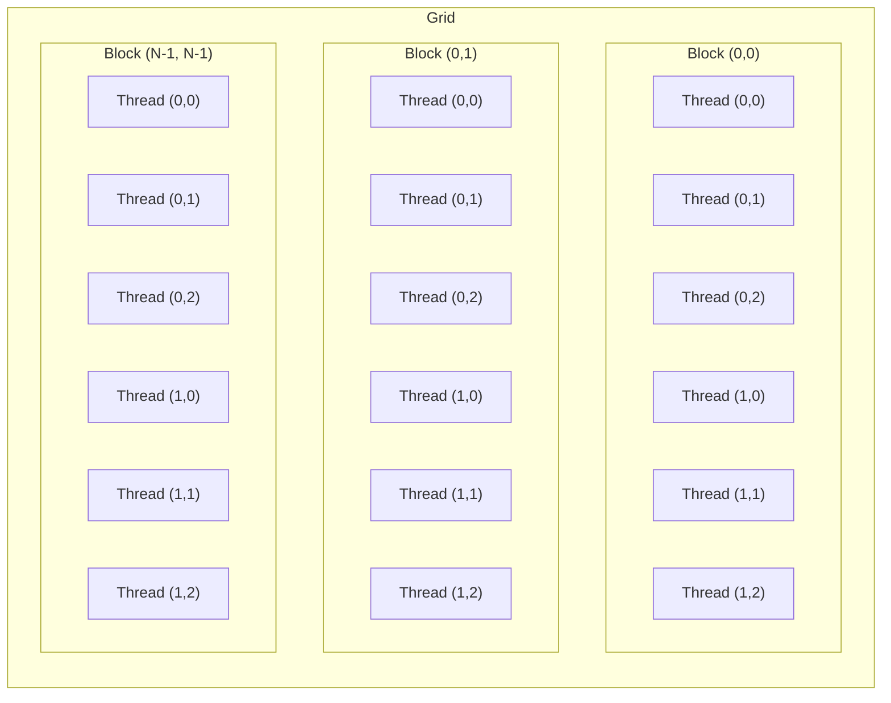
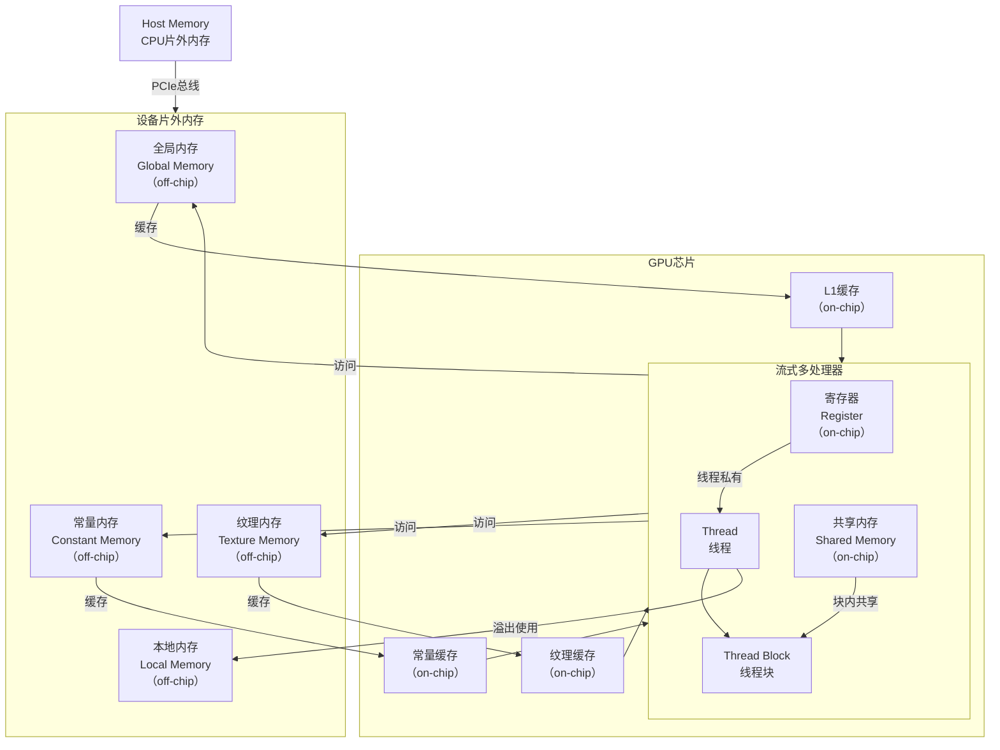

# CUDA编程基础

## Contents

[核函数](#核函数) [线程模型](#线程模型) [设备管理](#设备管理) [错误处理](#错误处理) [内存模型和内存管理](#内存模型和内存管理)

[流](#流) [事件](#事件) [原子操作](#原子操作) [性能优化策略](#性能优化策略) [高级并行模式](#高级并行模式) [多GPU编程](#多GPU编程) [CUDA库](#CUDA库) [调试工具](#调试工具) [CMake编译](#CMake编译)

## 核函数

- 核函数用法

    - 使用`__global__`修饰符声明

    - 默认异步执行

    - 返回类型必须是`void`

    - 调用语法：`kernel<<<grid, block>>>(args)`

- 示例代码：[ex1.cu](cu_codes/ex1.cu)

- 编译执行

```bash
nvcc ex1.cu -o ex1

./ex1
```

## 线程模型

- 线程层次



- 多维线程块中的线程索引

```c++
int tid = threadIdx.z * blockDim.x * blockDim.y +
          threadIdx.y * blockDim.x + 
          threadIdx.x;
```

- 多维网格中的线程块索引

```c++
int bid = blockIdx.z * blockDim.x * blockDim.y +
          blockIdx.y * blockDim.x + 
          blockIdx.x;
```

- 多维网格中的线程唯一索引

```c++
int idx = bid * (blockDim.x * blockDim.y * blockDim.z) + tid;
```

- 示例代码：[ex2.cu](cu_codes/ex2.cu)

## 设备管理

- 设备数量查询：

```c++
cudaError_t cudaGetDeviceCount(int* count);
```

- 设备设置：

```c++
cudaError_t cudaSetDevice(int device);
```

- 设备属性查询：

```c++
cudaError_t cudaGetDeviceProperties(cudaDeviceProp* prop, int device);
```

- 设备重置：

```c++
cudaError_t cudaDeviceReset(void);
```

- 当前设备查询：

```c++
cudaError_t cudaGetDevice(int* device);
```

- 设备同步

```c++
cudaError_t cudaDeviceSynchronize(void);
```

- 示例代码：[ex3.cu](cu_codes/ex3.cu)

## 错误处理

- 核心函数

```c++
// 获取错误描述字符串
const char* cudaGetErrorString(cudaError_t error);

// 获取最后一个错误（用于核函数）
cudaError_t cudaGetLastError(void);

// 同步设备并返回错误
cudaError_t cudaDeviceSynchronize(void);
```

- 常见错误

| 错误代码                           | 值   | 描述说明                                  |
|-----------------------------------|------|-----------------------------------------|
| `cudaSuccess`                     | 0    | 操作成功完成                              |
| `cudaErrorInvalidValue`           | 1    | 传递给API的参数无效                       |
| `cudaErrorMemoryAllocation`       | 2    | 显存分配失败（如`cudaMalloc`失败）         |
| `cudaErrorInitializationError`    | 3    | CUDA初始化失败                           |
| `cudaErrorNoDevice`               | 100  | 未找到支持的CUDA设备                      |
| `cudaErrorInvalidDevice`          | 101  | 设备ID不合法                             |
| `cudaErrorInvalidImage`           | 200  | 设备内核映像无效                          |
| `cudaErrorInvalidContext`         | 201  | 上下文无效或已销毁                         |
| `cudaErrorLaunchOutOfResources`   | 701  | 启动资源不足（线程块/共享内存配置过大）       |
| `cudaErrorLaunchTimeout`          | 702  | 内核执行超时（常见于显示设备上的长时内核）     |
| `cudaErrorUnknown`                | 999  | 未知错误                                 |

- 完整错误列表：[enum cudaError](https://developer.download.nvidia.cn/compute/DevZone/docs/html/C/doc/html/group__CUDART__TYPES_g3f51e3575c2178246db0a94a430e0038.html#g3f51e3575c2178246db0a94a430e0038)

- 示例代码：[ex4.cu](cu_codes/ex4.cu)

## 内存模型和内存管理

### 内存模型

- 内存层次



- 全局内存（Global Memory）

    - GPU上最大容量的内存（GB级别）
    - 高延迟（400-600时钟周期）
    - 所有线程均可访问
    - 主机可读写

    - 分配方式

    ```c++
    float* d_array;
    cudaMalloc(&d_array, size * sizeof(float));
    ```

- 共享内存（Shared Memory）

    - 片上内存，低延迟（1-2时钟周期）
    - 线程块内共享
    - 容量有限（通常48KB/块）

    - 声明方式

    ```c++
    __shared__ float s_data[BLOCK_SIZE];
    ```

- 常量内存（Constant Memory）

    - 只读内存，高速缓存
    - 容量小（通常64KB）
    - 所有线程可访问

    - 声明方式

    ```c++
    __constant__ float const_data[1024];
    ```

- 寄存器（Registers）

    - 最快的内存类型（1周期延迟）
    - 线程私有
    - 数量有限（每个线程最多255个）

    - 使用方式

    ```c++
    __global__ void kernel() {
        int tid = threadIdx.x; // 存储在寄存器
        float temp = 0.0f;     // 存储在寄存器
    }
    ```

- 本地内存（Local Memory）

    - 寄存器溢出时的后备存储
    - 编译时大小未知的局部数组

    - 实际位于全局内存中
    - 线程私有
    - 用于存储大型结构体或数组

- 纹理内存（Texture Memory）

    - 专为空间局部性访问优化
    - 自动缓存
    - 支持硬件插值

- 固定内存（Pinned Memory）

    - 主机内存（不可分页）
    - 加速主机-设备数据传输

    - 分配方式

    ```c++
    float* h_pinned;
    cudaMallocHost(&h_pinned, size * sizeof(float));
    ```

### 内存管理

- 内存管理函数

| 标准C内存管理函数 | CUDA内存管理函数 | 主机代码 | 设备代码 |
| -------------- | -------------- | ------- | ------- |
| malloc  | cudaMalloc | `float *fpHost_A;` `fpHost_A = (float *)malloc(nBytes);` | `float *fpDevice_A;` `cudaMalloc((float**)&fpDevice_A, nBytes);` |
| memcpy  | cudaMemcpy | `memcpy((void*)d, (void*)s, nBytes);`                    | `cudaMemcpy(Device_A, Host_A, nBytes, cudaMemcpyHostToHost);`    |
| memset  | cudaMemset | `memset(fpHost_A, 0, nBytes);`                           | `cudaMemset(fpDevice_A, 0, nBytes);`                             |
| free    | cudaFree   | `free(pHost_A);`                                         | `cudaFree(pDevice_A);`                                           |

- 内存复制方向

主机到主机：`cudaMemcpyHostToHost`

主机到设备：`cudaMemcpyHostToDevice`

设备到主机：`cudaMemcpyDeviceToHost`

设备到设备：`cudaMemcpyDeviceToDevice`

- 示例代码：[ex5.cu](cu_codes/ex5.cu)

## 流

- 机制作用

    - 任务序列：流是按顺序执行的操作序列（内存拷贝、内核启动等）

    - 并发执行：不同流中的操作可以并行执行

    - 执行单元：每个流有自己的命令队列，独立执行

    - 默认流：所有未指定流的操作在默认流（0号流）中顺序执行

- 创建和销毁流

```c++
cudaStream_t stream; // 定义流对象

// 创建流
cudaError_t err = cudaStreamCreate(&stream);

// 销毁流
cudaError_t err = cudaStreamDestroy(stream);
```

- 在流中执行操作

```c++
// 在指定流中启动核函数
kernel<<<grid, block, sharedMemSize, stream>>>(args);

// 在指定流中进行异步内存拷贝
cudaMemcpyAsync(dst, src, size, kind, stream);
```

- 流同步

```c++
// 阻塞主机直到流中所有操作完成
cudaError_t err = cudaStreamSynchronize(stream);

// 查询流是否完成（非阻塞）
cudaError_t err = cudaStreamQuery(stream);
if (err == cudaSuccess) {
    // 流已完成
} else if (err == cudaErrorNotReady) {
    // 流仍在执行
}
```

- 示例代码：[ex6.cu](cu_codes/ex6.cu)

## 事件

- 机制作用

    - 时间标记：记录GPU执行流中的特定点

    - 同步工具：协调不同流之间的操作顺序

    - 性能分析：精确测量内核执行时间和内存传输时间

    - 进度监控：异步查询操作完成状态

- 创建和销毁事件

```c++
cudaEvent_t event; // 定义事件对象

// 创建事件（flag=0为默认行为）
cudaError_t err = cudaEventCreate(&event);

// 创建禁用时序的事件（提高性能）
cudaError_t err = cudaEventCreateWithFlags(&event, cudaEventDisableTiming);

// 销毁事件
cudaError_t err = cudaEventDestroy(event);
```

- 记录事件

```c++
// 在指定流中记录事件
cudaError_t err = cudaEventRecord(event, stream);

// 在默认流中记录事件
cudaError_t err = cudaEventRecord(event, 0);
```

- 事件同步

```c++
// 阻塞主机直到事件完成
cudaError_t err = cudaEventSynchronize(event);

// 查询事件是否完成（非阻塞）
cudaError_t err = cudaEventQuery(event);
if (err == cudaSuccess) {
    // 事件已完成
} else if (err == cudaErrorNotReady) {
    // 事件尚未完成
}
```

- 计算时间间隔

```c++
// 计算时间间隔（毫秒）
float milliseconds = 0;
cudaEventElapsedTime(&milliseconds, event1, event2);
```

- 示例代码：[ex7.cu](cu_codes/ex7.cu)

## 原子操作

## 性能优化策略

## 高级并行模式

## 多GPU编程

## CUDA库

## 调试工具

## CMake编译

***
🔙 [Go Back](README.md)
