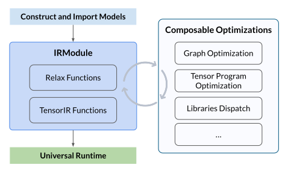

# TVM深度学习编译器


Code: [https://github.com/apache/tvm](https://github.com/apache/tvm) \
Doc Webpage: [https://tvm.apache.org/docs/](https://tvm.apache.org/docs/)

## 构建TVM环境

### 源码构建

```bash
conda create -n tvm-venv -c conda-forge \
    "llvmdev>=15" \
    "cmake>=3.24" \
    git \
    python=3.11

conda activate tvm-venv
conda install cython

git clone --recursive https://github.com/apache/tvm

mkdir build && cd build
cp ../cmake/config.cmake .

echo "set(CMAKE_BUILD_TYPE RelWithDebInfo)" >> config.cmake && \
echo "set(USE_LLVM \"llvm-config --ignore-libllvm --link-static\")" >> config.cmake && \
echo "set(HIDE_PRIVATE_SYMBOLS ON)" >> config.cmake && \
echo "set(USE_CUDA   ON)" >> config.cmake && \
echo "set(USE_METAL  OFF)" >> config.cmake && \
echo "set(USE_VULKAN OFF)" >> config.cmake && \
echo "set(USE_OPENCL OFF)" >> config.cmake && \
echo "set(USE_CUBLAS ON)" >> config.cmake && \
echo "set(USE_CUDNN  ON)" >> config.cmake && \
echo "set(USE_CUTLASS OFF)" >> config.cmake

cmake ..
cmake --build . --parallel $(nproc)

export TVM_LIBRARY_PATH=$(pwd)
pip install -e ../python
```

### 极简安装

```bash
pip install apache-tvm
```

### 验证安装

```bash
# Check version
python -c "import tvm; print(tvm.__version__)"

# Locate TVM Python package
python -c "import tvm; print(tvm.__file__)"

# Confirm which TVM library is used
python -c "import tvm; print(tvm.ffi)"
# python -c "import tvm; print(tvm._ffi)"

# Check device detection
python -c "import tvm; print(tvm.metal().exist)"
python -c "import tvm; print(tvm.cuda().exist)"
python -c "import tvm; print(tvm.vulkan().exist)"

# Reflect TVM build option
python -c "import tvm; print('\n'.join(f'{k}: {v}' for k, v in tvm.support.libinfo().items()))"
```

## TVM总体流



- 构建或导入模型：构建神经网络模型或从其他框架（如PyTorch、ONNX）导入预训练模型，并创建TVM IRModule，其中包含编译所需的所有信息，包括用于计算图的高级Relax函数和用于张量程序的低级TensorIR函数

- 执行可组合优化：执行一系列优化转换，如图形优化、张量程序优化和库调度

- 构建和通用部署：将优化后的模型构建为可部署到通用运行时的模块，并在不同的设备（如CPU、GPU或其他加速器）上执行

## Relax IR

- Relay是TVM的高级中间表示，用于表示深度学习模型和计算图
- Relay采用函数式编程范式，支持各种优化变换，如图优化、量化等
- Relay允许从前端框架（如PyTorch、ONNX）导入模型，并转换为可优化的形式

Relay现已被Relax取代

- Relax采用符号形状表示张量维度，支持全局跟踪动态形状关系
- Relax支持从高级神经网络层到低级张量操作的跨级抽象，实现跨层级优化
- Relax提供可组合的变换框架，可选择性地应用于模型的不同组件，提供灵活的自定义和优化选项

### Relax示例

```python
import tvm
from tvm import relax

x = relax.Var("x", relax.TensorStructInfo([1, 784], "float32"))
w1 = relax.Var("w1", relax.TensorStructInfo([256, 784], "float32"))
b1 = relax.Var("b1", relax.TensorStructInfo([256], "float32"))
w2 = relax.Var("w2", relax.TensorStructInfo([10, 256], "float32"))
b2 = relax.Var("b2", relax.TensorStructInfo([10], "float32"))

hidden = relax.op.add(relax.op.matmul(x, relax.op.permute_dims(w1)), b1)
hidden = relax.op.nn.relu(hidden)
output = relax.op.add(relax.op.matmul(hidden, relax.op.permute_dims(w2)), b2)

func = relax.Function([x, w1, b1, w2, b2], output, ret_struct_info=relax.TensorStructInfo([1, 10], "float32"))
mod = tvm.IRModule.from_expr(func)
mod.show()
```

## 算子定义

- 在TVM中，可以使用Tensor Expression定义自定义算子
- TE提供了一种声明式的方式来描述计算，然后通过调度（Schedule）来优化其实现

### 算子定义示例

一个简单的张量加

```python
import tvm
from tvm import te
import numpy as np

n = 10
A = te.placeholder((n,), name="A")
B = te.compute((n,), lambda i: A[i] + 1.0, name="B")
func = te.create_prim_func([A, B])
mod = tvm.build(func, target="llvm")
dev = tvm.cpu(0)
a = tvm.nd.array(np.arange(n).astype("float32"), dev)
b = tvm.nd.array(np.zeros(n, dtype="float32"), dev)
mod(a, b)
print(b.numpy())
```

## 部署示例

- TVM支持将优化后的模型部署到各种后端，部署过程包括构建可执行模块并在运行时执行

### CPU基础部署

构造一个简单的MLPModel

```python
import tvm
from tvm import relax
from tvm.relax.frontend import nn
import numpy as np


class MLPModel(nn.Module):
    def __init__(self):
        super(MLPModel, self).__init__()
        self.fc1 = nn.Linear(784, 256)
        self.relu1 = nn.ReLU()
        self.fc2 = nn.Linear(256, 10)

    def forward(self, x):
        x = self.fc1(x)
        x = self.relu1(x)
        x = self.fc2(x)
        return x


mod, param_spec = MLPModel().export_tvm(
    spec={"forward": {"x": nn.spec.Tensor((1, 784), "float32")}}
)

mod = relax.get_pipeline("zero")(mod)
mod.show()

target = tvm.target.Target("llvm")
device = tvm.cpu()

ex = relax.build(mod, target)
vm = relax.VirtualMachine(ex, device)

params = []
for _, param_info in param_spec:
    param_np = np.random.rand(*param_info.shape).astype("float32")
    params.append(tvm.nd.array(param_np, device=device))

data = np.random.rand(1, 784).astype("float32")
tvm_data = tvm.nd.array(data, device=device)

out = vm["forward"](tvm_data, *params)
print(out.numpy())
```

### CUDA基础部署

使用dlight自动优化GPU

```python
import tvm
from tvm import relax
from tvm.relax.frontend import nn
import numpy as np
from tvm import dlight as dl


class MLPModel(nn.Module):
    def __init__(self):
        super(MLPModel, self).__init__()
        self.fc1 = nn.Linear(784, 256)
        self.relu1 = nn.ReLU()
        self.fc2 = nn.Linear(256, 10)

    def forward(self, x):
        x = self.fc1(x)
        x = self.relu1(x)
        x = self.fc2(x)
        return x


mod, param_spec = MLPModel().export_tvm(
    spec={"forward": {"x": nn.spec.Tensor((1, 784), "float32")}}
)

mod = relax.get_pipeline("zero")(mod)

target = tvm.target.Target("cuda")
device = tvm.cuda()

with target:
    mod = dl.ApplyDefaultSchedule(
        dl.gpu.Matmul(),
        dl.gpu.GEMV(),
        dl.gpu.Reduction(),
        dl.gpu.GeneralReduction(),
        dl.gpu.Fallback(),
    )(mod)
mod.show()

ex = relax.build(mod, target)
vm = relax.VirtualMachine(ex, device)

params = []
for _, param_info in param_spec:
    param_np = np.random.rand(*param_info.shape).astype("float32")
    params.append(tvm.nd.array(param_np, device=device))

data = np.random.rand(1, 784).astype("float32")
tvm_data = tvm.nd.array(data, device=device)

out = vm["forward"](tvm_data, *params)
print(out.numpy())
```

也可以手动绑定

```python
with target:
    new_mod = tvm.IRModule()
    for gv, func in mod.functions.items():
        if not isinstance(func, tir.PrimFunc):
            new_mod[gv] = func
            continue
        sch = tir.Schedule(func)
        root = sch.get_block("root")
        for block in sch.get_child_blocks(root):
            loops = sch.get_loops(block)
            if len(loops) >= 1:
                sch.bind(loops[0], "blockIdx.x")
            if len(loops) >= 2:
                sch.bind(loops[1], "threadIdx.x")
        new_mod[gv] = sch.mod["main"]
    mod = new_mod
```

再来一个矩阵乘简单示例

```python
import tvm
from tvm import te
import numpy as np

n = 16
A = te.placeholder((n, n), name="A")
B = te.placeholder((n, n), name="B")
k = te.reduce_axis((0, n), name="k")
C = te.compute((n, n), lambda i, j: te.sum(A[i, k] * B[k, j], axis=k), name="C")

func = te.create_prim_func([A, B, C])
mod = tvm.IRModule({"main": func})
mod.show()

sch = tvm.tir.Schedule(mod)
block = sch.get_block("C", func_name="main")
loops = sch.get_loops(block)

i, j = loops[:2]
io, ii = sch.split(i, factors=[None, 4])
jo, ji = sch.split(j, factors=[None, 4])
sch.bind(io, "blockIdx.x")
sch.bind(jo, "blockIdx.y")
sch.bind(ii, "threadIdx.x")
sch.bind(ji, "threadIdx.y")

target = tvm.target.Target("cuda")
device = tvm.cuda(0)

cuda_mod = tvm.build(sch.mod, target=target)

a_np = np.ones((n, n)).astype(np.float32)
b_np = np.ones((n, n)).astype(np.float32)
a = tvm.nd.array(a_np, device=device)
b = tvm.nd.array(b_np, device=device)
c = tvm.nd.array(b_np, device=device)

cuda_mod(a, b, c)
print(c.numpy())
```

## AutoTVM

- AutoTVM是TVM的自动调优框架，用于优化张量表达式的性能
- AutoTVM通过搜索最佳的调度策略（如循环 tiling、并行化）来生成高效的内核代码
- AutoTVM支持基于模板的调优，并可以使用机器学习模型加速搜索过程

AutoTVM现已被Meta-Schedule取代

- Meta-Schedule使用基于规则的调度和自动调优，提供更大搜索空间和更好性能，无需手动定义模板
- Meta-Schedule内置成本模型和调优算法，支持机器学习驱动的搜索加速
- Meta-Schedule更好地处理动态形状和更复杂的IR，支持TIR的端到端优化
- Meta-Schedule减少了手动配置需求，使调优过程更高效和用户友好

### Meta-Schedule示例

优化一个矩阵乘

```python
import tvm
from tvm import meta_schedule as ms
from tvm.script import tir as T
import numpy as np
import tvm.testing
from tvm.meta_schedule import tir_integration

@T.prim_func(private=True)
def matmul(a: T.handle, b: T.handle, c: T.handle) -> None:
    A = T.match_buffer(a, (128, 128), "float32")
    B = T.match_buffer(b, (128, 128), "float32")
    C = T.match_buffer(c, (128, 128), "float32")
    for i, j, k in T.grid(128, 128, 128):
        with T.block("update"):
            vi, vj, vk = T.axis.remap("SSR", [i, j, k])
            with T.init():
                C[vi, vj] = 0.0
            C[vi, vj] = C[vi, vj] + A[vi, vk] * B[vj, vk]

target = tvm.target.Target("llvm -num-cores=4")

# Tuning
database = ms.tune_tir(
    mod=matmul,
    target=target,
    max_trials_global=64,
    num_trials_per_iter=2,
    work_dir="./tune_tmp",
    runner=ms.runner.LocalRunner(
        evaluator_config=ms.runner.EvaluatorConfig(
            number=3,
            repeat=1,
        )
    ),
    cost_model=ms.cost_model.RandomModel(),
)

sch = tir_integration.compile_tir(database, matmul, target)
print(sch.trace)

# Build the tuned function
with tvm.transform.PassContext(opt_level=3):
    rt = tvm.build(sch.mod, target=target)

# Test
a_np = np.random.uniform(size=(128, 128)).astype(np.float32)
b_np = np.random.uniform(size=(128, 128)).astype(np.float32)
c_np = a_np.dot(b_np.transpose())

dev = tvm.cpu()
a = tvm.nd.array(a_np, device=dev)
b = tvm.nd.array(b_np, device=dev)
c = tvm.nd.array(np.zeros((128, 128), dtype="float32"), device=dev)

f_timer = rt.time_evaluator("main", dev, number=10)
print("Latency:", f_timer(a, b, c).mean)

tvm.testing.assert_allclose(c.numpy(), c_np, rtol=1e-5)
```

***
🔙 [Go Back](README.md)
