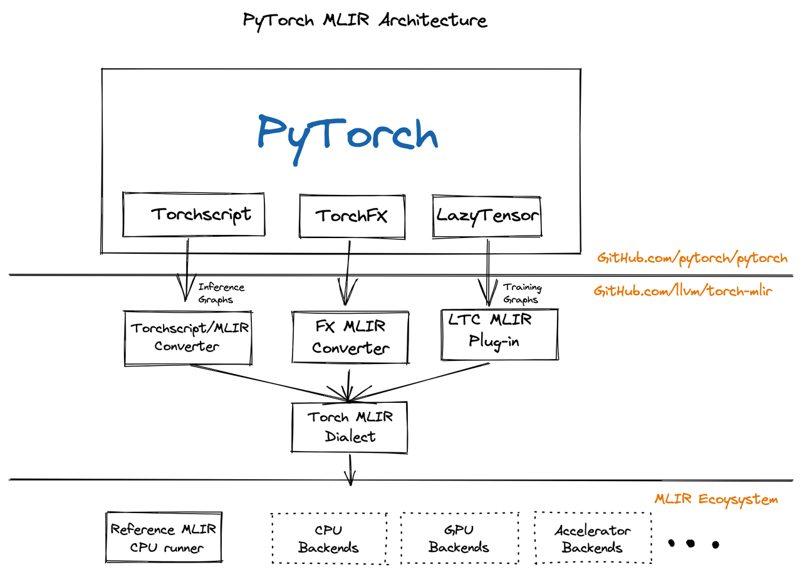

# Torch-MLIR 连接PyTorch和MLIR

Code: [https://github.com/llvm/torch-mlir](https://github.com/llvm/torch-mlir)

 

## 构建Torch-MLIR环境

- 直接安装快照

```bash
conda create -n torch-mlir python=3.11 -y
conda activate torch-mlir
python -m pip install --upgrade pip

pip install --pre torch-mlir torchvision \
  --extra-index-url https://download.pytorch.org/whl/nightly/cpu \
  -f https://github.com/llvm/torch-mlir-release/releases/expanded_assets/dev-wheels
```

- 或编译安装

编译失败多次，暂时放弃

## Torch-MLIR测试

### 矩阵乘

- python代码

```python
import torch
from torch_mlir import fx
from torch_mlir.compiler_utils import run_pipeline_with_repro_report


class MulModel(torch.nn.Module):
    def __init__(self):
        super().__init__()

    def forward(self, x, y):
        return torch.matmul(x, y)


if __name__ == "__main__":
    print("Input tensors ...\n")
    input_x = torch.randn(3, 4)
    input_y = torch.randn(4, 3)
    print(f"{input_x}\n"
          f"{input_y}\n")

    print("Pytorch infer ...\n")
    model = MulModel()
    result = model.forward(input_x, input_y)
    print(f"{result}\n")

    print("Generate MLIR IR with ATEN ...\n")
    module = fx.export_and_import(model, input_x, input_y)
    print(module)

    print("Lowering MLIR IR to Linalg ...\n")
    run_pipeline_with_repro_report(
        module,
        (
            "builtin.module("
            "func.func(torch-simplify-shape-calculations),"
            "func.func(torch-decompose-complex-ops),"
            "torch-backend-to-linalg-on-tensors-backend-pipeline)"
        ),
        "Lowering Torch IR to Linalg dialect",
        enable_ir_printing=False)
    print(module)
```

- 输出

```
Input tensors ...

tensor([[-1.6941, -1.5956,  2.6500,  0.6940],
        [-0.5094, -0.6371, -0.0372, -0.7704],
        [ 0.7837,  1.5455,  0.9153,  0.1721]])
tensor([[ 1.1701, -0.3016, -2.0718],
        [ 0.3632, -0.9225, -0.7194],
        [ 0.3483,  0.3780, -0.1266],
        [ 1.4833,  1.5459, -1.9157]])

Pytorch infer ...

tensor([[-0.6092,  4.0575,  2.9925],
        [-1.9833, -0.4637,  2.9944],
        [ 2.0524, -1.0501, -3.1811]])

Generate MLIR IR with ATEN ...

module {
  func.func @main(%arg0: !torch.vtensor<[3,4],f32>, %arg1: !torch.vtensor<[4,3],f32>) -> !torch.vtensor<[3,3],f32> {
    %0 = torch.aten.matmul %arg0, %arg1 : !torch.vtensor<[3,4],f32>, !torch.vtensor<[4,3],f32> -> !torch.vtensor<[3,3],f32>
    return %0 : !torch.vtensor<[3,3],f32>
  }
}

Lowering MLIR IR to Linalg ...

module {
  func.func @main(%arg0: tensor<3x4xf32>, %arg1: tensor<4x3xf32>) -> tensor<3x3xf32> {
    %cst = arith.constant 0.000000e+00 : f32
    %0 = tensor.empty() : tensor<3x3xf32>
    %1 = linalg.fill ins(%cst : f32) outs(%0 : tensor<3x3xf32>) -> tensor<3x3xf32>
    %2 = linalg.matmul ins(%arg0, %arg1 : tensor<3x4xf32>, tensor<4x3xf32>) outs(%1 : tensor<3x3xf32>) -> tensor<3x3xf32>
    return %2 : tensor<3x3xf32>
  }
}
```

### FFT

- python代码

```python
import torch
from torch_mlir import fx


class FFTModel(torch.nn.Module):
    def __init__(self):
        super().__init__()

    def forward(self, x):
        return torch.fft.fft(x)


if __name__ == "__main__":
    print("Input tensors ...\n")
    input = torch.tensor([1.0, 2.0, 3.0, 4.0])
    print(f"{input}\n")

    print("Pytorch infer ...\n")
    model = FFTModel()
    result = model.forward(input)
    print(f"{result}\n")

    print("Generate MLIR IR with ATEN ...\n")
    module = fx.export_and_import(model, input)
    print(module)
```

- 输出

```
Input tensors ...

tensor([1., 2., 3., 4.])

Pytorch infer ...

tensor([10.+0.j, -2.+2.j, -2.+0.j, -2.-2.j])

Generate MLIR IR with ATEN ...

module {
  func.func @main(%arg0: !torch.vtensor<[4],f32>) -> !torch.vtensor<[4],complex<f32>> {
    %none = torch.constant.none
    %int-1 = torch.constant.int -1
    %none_0 = torch.constant.none
    %0 = torch.aten.fft_fft %arg0, %none, %int-1, %none_0 : !torch.vtensor<[4],f32>, !torch.none, !torch.int, !torch.none -> !torch.vtensor<[4],complex<f32>>
    return %0 : !torch.vtensor<[4],complex<f32>>
  }
}
```

### DFT

- python代码

```python
import torch
from torch_mlir import fx
from torch_mlir.compiler_utils import run_pipeline_with_repro_report


class DFTModel(torch.nn.Module):
    def __init__(self):
        super().__init__()

    def forward(self, x_real, x_imag):
        N = x_real.size(0)
        n = torch.arange(N).unsqueeze(1)
        k = torch.arange(N).unsqueeze(0)

        M_real = torch.cos(2 * torch.pi * n * k / N)
        M_imag = -torch.sin(2 * torch.pi * n * k / N)

        result_real = torch.matmul(x_real, M_real) - torch.matmul(x_imag, M_imag)
        result_imag = torch.matmul(x_imag, M_real) + torch.matmul(x_real, M_imag)

        return result_real, result_imag


if __name__ == "__main__":
    print("Input tensors ...\n")
    input_real = torch.tensor([1.0, 2.0, 3.0, 4.0])
    input_imag = torch.zeros(4)
    print(f"Real: {input_real}\n"
          f"Imag: {input_imag}\n")

    print("Pytorch infer ...\n")
    model = DFTModel()
    result = model.forward(input_real, input_imag)
    print(f"Real: {result[0]}\n"
          f"Imag: {result[1]}\n")

    print("Generate MLIR IR with ATEN ...\n")
    module = fx.export_and_import(model, input_real, input_imag)
    print(module)

    print("Lowering MLIR IR to Linalg ...\n")
    run_pipeline_with_repro_report(
        module,
        (
            "builtin.module("
            "func.func(torch-simplify-shape-calculations),"
            "func.func(torch-decompose-complex-ops),"
            "torch-backend-to-linalg-on-tensors-backend-pipeline)"
        ),
        "Lowering Torch IR to Linalg dialect",
        enable_ir_printing=False)
    print(module)
```

***
🔙 [Go Back](README.md)
