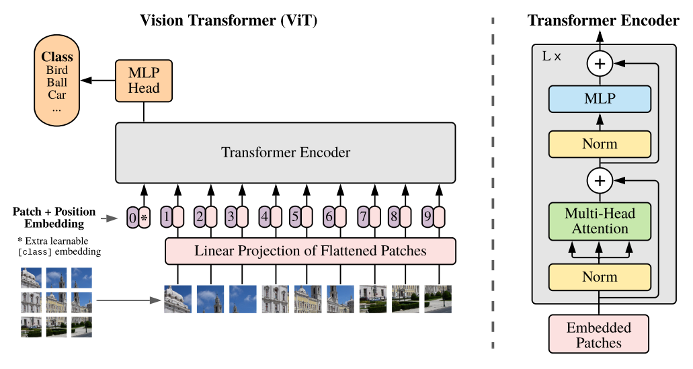

# Vision Transformer (ViT) 模型

Paper: [An Image is Worth 16x16 Words: Transformers for Image Recognition at Scale](https://arxiv.org/abs/2010.11929)

## ViT理论基础

### ViT模型框架

- 核心思想

将图像分割为固定大小的图块（patches），每个图块视为一个"词向量"，直接应用标准Transformer Encoder处理图像分类任务。

### 图块嵌入（Patch Embedding）

### 位置编码（Position Embedding）

### Transformer Encoder 层

### 分类头

## Pytorch构建ViT

***
👉 Updating...
🔙 [Go Back](README.md)
